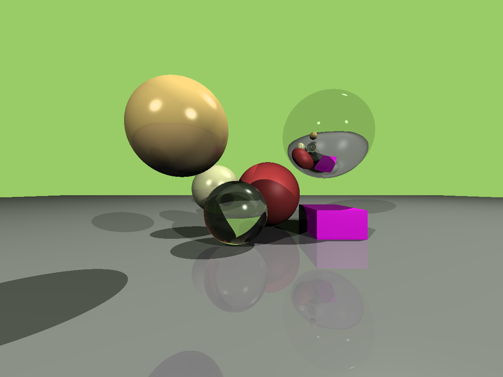
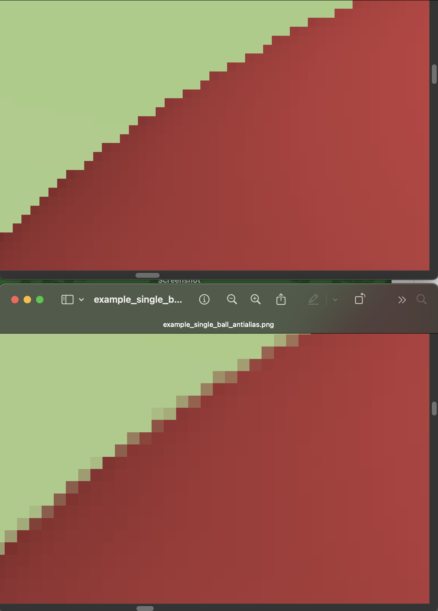

## Tiny Computer Graphics

This is rust implementation of [tinyrenderer](https://github.com/ssloy/tinyrenderer/wiki), [tinyraytracer](https://github.com/ssloy/tinyraytracer/wiki) and [RayTracerInOneWeekend](https://raytracing.github.io/books/RayTracingInOneWeekend.html).

## Some Results

|       tinyrenderer        |               tinyraytracer                |
| :-----------------------: | :----------------------------------------: |
|  |  |

## Some Examples

|           examples           |               Images               |
| :--------------------------: | :--------------------------------: |
| [first](./examples/first.rs) |  |

## Features

### anti-aliasing

|                  before                  |                       after                        |
| :--------------------------------------: | :------------------------------------------------: |
|  |  |

|               zoom in                |
| :----------------------------------: |
|  |

### Monte Carlo Path Tracing

|                      result                      |
| :----------------------------------------------: |
|  |

### Rotating Boxes

|                 boxes                 |
| :-----------------------------------: |
|  |

